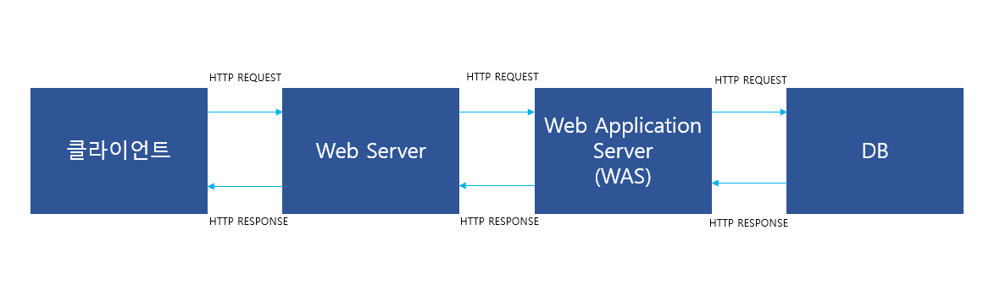
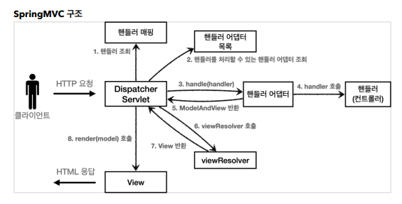

# What is Spring MVC Framework
## 목차
1. 일반적인 web 아키텍처
1. Spring MVC
2. Spring MVC의 구조
3. 참고

## 일반적인 web 아키텍처

### Web Server
- HTTP 기반으로 동작
- 정적 리소스 제공(HTML, CSS, JS, etc.)
- ex) NGNIX, APACHE

### Web Application Server(WAS)
- HTTP 기반으로 동작
- 웹 서버 기능 포함(정적 리소스 제공 가능)
- 프로그램 코드를 실행해서 애플리케이션 로직 수행 
    - 동적 HTML, HTTP API(JSON)
    - 서블릿, JSP, 스프링 MVC
- ex) 톰캣(Tomcat), etc.
- 자바는 서블릿 컨테이너 기능을 제공하면 WAS라고 한다(서블릿 없이 자바 코드를 실행하는 서버 프레임워크도 있다). 

### WAS에서 처리해야 하는 업무
1. 서버 TCP/IP 연결 대기, 소켓 연결
2. HTTP 요청 메시지를 파싱해서 읽기
3. POST 방식, /save URL 인지
4. Content-Type 확인
5. HTTP 메시지 바디 내용 파싱
    - ex) username, age 데이터를 사용할 수 있게 파싱
6. __비즈니스 로직 실행__
    - __데이터베이스에 저장 요청__
7. HTTP 응답 메시지 생성 시작
    - HTTP 시작 라인 생성
    - Header 생성
    - 메시지 바디에 HTML 생성에서 입력
8. TCP/IP에 응답 전달, 소켓 종료
-> 이 업무에서 의미있는 비즈니스 로직은 6번만 있다.    
-> 서블릿은 6번을 제외한 업무를 한다.

### Servlet   
- 동적 웹 페이지를 만들 때 사용되는 자바 기반의 웹 애플리케이션 프로그래밍 기술, 웹 요청과 응답의 흐름을 간단한 메서드 호출만으로 체계적으로 다룰 수 있게 해준다.
- HTTP 요청 시
    - WAS는 Request, Response 객체를 새로 만들어서 서블릿 객체 호출
    - 개발자는 Request 객체에서 HTTP 요청 정보를 편리하게 꺼내서 사용
    - 개발자는 Response 객체에 HTTP 응답 정보를 편리하게 입력
    - WAS는 Response 객체에 담겨 있는 내용으로 HTTP 응답 정보를 생성

### Servlet Container
- 톰캣처럼 서블릿을 지원한 WAS를 서블릿 컨테이너라고 함 
- 서블릿 컨테이너는 서블릿 객체를 생성, 초기화, 호출, 종료하는 생명주기 관리
- 서블릿 객체는 __싱글톤으로 관리__
    - 고객의 요청이 올 때 마다 계속 객체를 생성하는 것을 비효율
    - 최초 로딩 시점에 서블릿 객체를 미리 만들어두고 재활용
    - 모든 고객 요청은 동일한 서블릿 객체 인스턴스에 접근
    - 공유 변수 사용 주의
    - 서블릿 컨테이너 종료 시 함께 종료
- JSP도 서블릿으로 변환 되어서 사용
- 동시 요청을 위한 멀티 쓰레드 처리 지원

## Spring MVC
Spring에서 제공하는 웹 모듈로, Model, View, Controller 세가지 구성요소를 사용해 사용자의 다양한 HTTP Request를 처리하고 단순한 텍스트 형식의 응답부터 REST 형식의 응답은 물론 View를 표시하는 HTML을 return 하는 응답까지 다양한 응답을 할 수 있도록 만들어놓은 프레임워크이다.
> controller: HTTP 요청을 받아서 파라미터를 검증하고, 비즈니스 로직을 실행한다. 뷰에 전달할 결과 데이터를 조회해서 모델에 담는다.
>> controller에 비즈니스 로직을 둔다면 controller가 너무 많은 역할을 담당하기 때문에 일반적으로 비즈니스 로직은 service라는 계층을 별도로 만들어서 처리한다. controller는 service를 호출한다.
> model: 뷰에 출력할 데이터를 담아둔다. 뷰가 필요한 데이터를 모두 모델에 담아서 전달해주는 덕분에 뷰는 비즈니스 로직이나 데이터 접근을 몰라도 되고, 화면을 렌더링 하는 일에 집중할 수 있다.
> view: 모델에 담겨있는 데이터를 사용해서 화면을 그리는 일에 집중한다.

## Spring MVC의 구조

### DispatcherServlet 
- Spring MVC의 핵심
- FrontController 패턴으로 구현됨 
- 부모 클래스에서 HttpServlet을 상속 받아서 사용하고, 서블릿으로 동작한다.
    - DispatcherServlet -> FrameworkServlet -> HttpServletBean -> HttpServlet
- 스프링 부트는 DispatcherServlet을 서블릿으로 자동으로 등록하면서 모든 경로에 대해서 매핑한다.
- 요청 흐름
    - 서블릿이 호출되면 HttpServlet이 제공하는 service()가 호출된다.
    - 스프링 MVC는 DispatcherServlet의 부모인 FrameworkServlet에서 service()를 오버라이드 해두었다.
    - FrameworkServlet.service()를 시작으로 여러 메서드가 호출되면서 DispatcherServlet.doDispatch()가 호출된다.
> FrontController 패턴: 프론트 컨트롤러 서블릿 하나로 클라이언트의 요청을 받음/ 프론트 컨트롤러가 요청에 맞는 컨트롤러를 찾아서 호출(입구를 하나로)/ 공통 처리 가능/ 프론트 컨트롤러를 제외한 나머지 컨트롤러는 서블릿을 사용하지 않아도 됨

### Spring MVC 동작 순서
1. 핸들러 조회: 핸들러 매핑을 통해 요청 URL에 매핑된 핸들러(컨트롤러)를 조회한다.   
    - @RequestMapping, @Controller(스프링이 자동으로 스프링 빈으로 등록, 스프링 MVC에서 애노테이션 기반 컨트롤러로 인식한다.)
2. 핸들러 어댑터 조회: 핸들러를 실행할 수 있는 핸들러 어댑터를 조회한다.
3. 핸들러 어댑터 실행: 핸들러 어댑터를 실행한다.
4. 핸들러 실행: 핸들러 어댑터가 실제 핸들러를 실행한다.
5. ModelAndView 반환: 핸들러 어댑터는 핸들러가 반환하는 정보를 ModelAndView로 변환해서 반환한다.
6. viewResolver 호출: 뷰 리졸버를 찾고 실행한다.
7. View 반환: 뷰 리졸버를 뷰의 논리 이름을 물리 이름으로 바꾸고, 렌더링 역할을 담당하는 뷰 객체를 반환한다. 
8. 뷰 렌더링: 뷰를 통해서 뷰를 렌더링한다.

## 참고
[인프런]스프링MVC 1편 - 김영한

