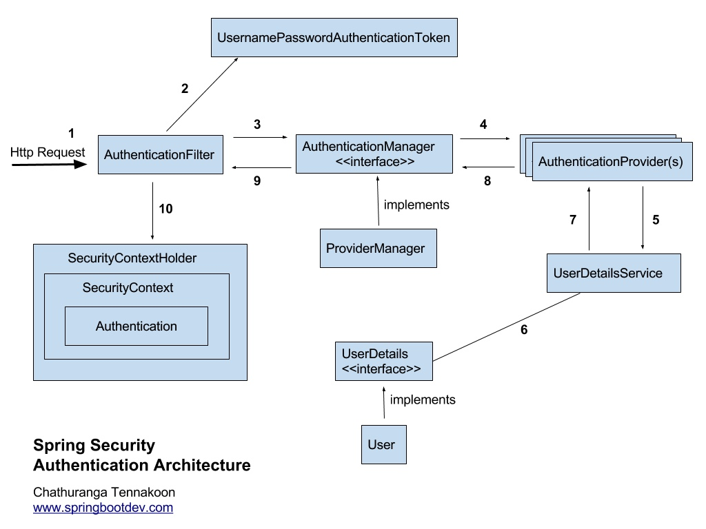

# Spring Security
- 막강한 인증(Autentication)과 인가(Authorization, 권한 부여) 기능을 가진 프레임워크
- 사실상 스프링 기반의 애플리케이션에서는 보안을 위한 표준
- 스프링의 대부분 프로젝트들(MVC, Data, Batch)처럼 확장성을 고려한 프레임워크라서 다양한 요구사항을 손쉽게 추가하고 변경할 수 있음
> 인증: 해당 사용자가 본인이 맞는지 확인하는 절차(보호된 리소스에 접근하는 대상에게 적절한 접근 권한이 있는지 확인하는 일련의 과정)
>> 보호된 리소스에 접근하는 대상(사용자): 접근 주체(Pricipal)
> 인가: 인증된 사용자가 요청한 자원에 접근 가능한지 결정하는 절차
- 인증을 하고 인가를 한다
- 인증과 권한에 대한 부분을 Filter 흐름에 따라 처리하고 있다(스프링 mvc와 분리되어 관리 밎 동작).
> 필터와 인터셉터의 차이 : 실행되는 시점
>> 필터: Dispatcher servlet으로 요청이 도착하기 전에 동작
>> 인터셉터: Dispatcher servlet을 지나고 controller에 도착하기 전에 동작
- 기본적으로 인증 정보는 인메모리 세션 저장소인 SecurityContextHolder에 세션-쿠키 방식으로 저장

### 장점
보안과 관련해서 체계적으로 많은 옵션을 제공해주기 때문에 개발자 입장에서는 일일이 보안관련 로직을 작성하지 않아도 된다.

## Spring Security 동작 방식(Form 형식으로 Request를 보내는 경우)

1. 로그인 정보를 담아 서버에 인증 요청(Request)
2. AuthenticationFilter가 이를 가로채서 UsernamePasswordAuthenticationToken(인증용 객체)를 생성(리턴)해서 세션에 저장한다.
3. AuthenticationManager의 구현체 ProviderManager에 Authentication과 UsernamePasswordAuthenticationToken을 전달한다.
4. AuthenticationManager는 검증을 위해 AuthenticationProvider에게 Authentication과 UsernamePasswordAuthenticationToken을 전달한다.
5. DB에 담긴 사용자 인증 정보와 비교하기 위해 UserDetailsService에 사용자 정보를 넘겨준다.
6. DB에서 찾은 사용자 정보인 UserDetails 객체를 만든다.
7. AuthenticationProvider는 UserDetails를 넘겨받고 비교한다.
8. 인증이 완료되면 권한과 사용자 정보를 담은 Authentication 객체가 반환된다.
9. AuthenticationFilter까지 Authentication 정보를 전달한다.
10. Authentication을 SecurityContext에 저장한다.

Authentication 정보는 결국 SecurityContextHolder 세션 영역에 있는 SecurityContext에 Authentication 객체를 저장한다(세션에 사용자 정보를 저장한다는 것은 전통적인 세션-쿠키 기반의 인증 방식을 사용한다는 것을 의미).

# JWT(Json Web Token)
JWT는 웹표준으로서 일반적으로 클라이언트와 서버, 서비스와 서비스 사이 통신 시 __인가(Authorization)__ 을 위해 사용하는 토큰이다.

__HEADER.PAYLOAD.SIGNATURE__
- HEADER: 토큰 타입과 해싱 알고리즘 저장
- PAYLOAD: 실제로 전달하는 정보 저장
- SIGNATURE: 위변조를 방지하기 위한 값 저장

> Cookie & Session: 서버의 어떠한 저장소에 해당 값과 매칭되는 value를 가지고 있어야 한다. 서버 자원이 많이 사용되는 단점이 있다.
> JWT는 Cookie & Session의 자원 문제를 해결하기 위한 방법, 토큰 자체에 유저 정보를 담아서 암호화한 토큰이다. 암호화된 내용은 디코딩 과정을 통해서 해석이 가능하다.

## JWT를 통한 인증 절차
1. 사용자가 로그인을 한다.
2. 서버에서 계정 정보를 읽어 사용자를 확인 후, 사용자의 고유 ID 값을 부여한 후 기타 정보와 함께 Payload에 집어 넣는다.
3. JWT 토큰의 유효 기간을 설정한다.
4. 암호화할 Secret key를 이용해 Access Token을 발급한다.
5. 사용자는 Access Token을 받아 저장 후, 인증이 필요한 요청마다 토큰을 헤더에 실어 보낸다.
6. 서버에서는 해당 토큰의 Verify Signature를 Secret key로 복호화한 후, 조작 여부, 유효 기간을 확인한다.
7. 검증이 완료되었을 경우, Payload를 디코딩 하여 사용자의 ID에 맞는 데이터를 가져온다.
> JWT는 보통 Access Token의 유효기간이 매우 짧다(보안 때문). 이를 해결하기 위해 Refresh Token(Access Token이 만료되면 새로운 JWT를 발급할 수 있는 토큰)을 따로 발급해준다.

# OAuth 2.0
- 인증을 위한 개방형 표준 프로토콜
- 소셜 로그인(간편 로그인) 기능도 OAuth 2.0 프로토콜 기반의 사용자 인증 기능을 제공
- OAuth 로그인 구현을 하지 않으면 직접 구현해야 하는 기능이 많기 때문에 사용
> OAuth 로그인 구현을 하지 않을 때 구현해야 하는 기능: 로그인 시 보안, 회원가입 시 이메일 혹은 전화번호 인증, 비밀번호 찾기, 비밀번호 변경, 회원정보 변경 등
- OAuth 로그인 구현을 하면 서비스 개발에 집중할 수 있다.
 
## OAuth 구성 요소
- Resource Owner: 웹 서비스를 이용하려는 유저, 자원(개인정보)을 소유하는 자, 사용자
- Clinet: 자사 또는 개인이 만든 애플리케이션 서버
- Authorization Server: 권한을 부여(인증에 사용할 아이템을 제공)해주는 서버(사용자- 이 서버로 ID, PW를 넘겨 Authorization Code를 발급받을 수 있음/ Client- 이 서버로 Authorization Code를 넘겨 Token을 발급 받을 수 있음)
- Resource Server: 사용자의 개인 정보를 가지고 있는 애플리케이션 회사 서버(Client는 Token을 이 서버로 넘겨 개인정보를 응답 받을 수 있다.)
- Access Token: 자원에 대한 접근 권한을 Resouce Owner가 인가하였음을 나타내는 자격증명
- Refresh Token: 보안상 만료기간이 짧은 Access Token을 재발급할 수 있게 하는 토큰

## < 권한 부여 방식 >
### 1. Authorization Code Grant (권한 부여 승인 코드 방식)
- 권한 부여 승인을 위해 자체 생성한 Authorization Code를 전달하는 방식으로 많이 쓰이고 기본이 되는 방식(Resource Owner에게 사용 허락을 받았다는 증서인 권한 코드를 가지고 Access Token을 요청하는 방식)
> 1. Client가 Authorization Server에 Authorization Code 요청 
2. Authorization Server에서 Resource Owner가 권한 부여 서버에 사용자 인증 및 리소스 사용 범위 확인하는 것을 요청
3. Resource Owner는 Client에 Authorization Code를 Redirect 하여 전송  
- 간편 로그인 기능에서 사용되는 방식으로 클라이언트가 사용자를 대신해서 특정 자원에 접근을 요청할 때 사용
- Refresh Token의 사용이 가능
- 보통 서버 사이드에서 인증을 처리하는 경우 이 방식을 많이 사용

### 2. Implicit Grant(암시적 승인 방식)
- 추가적인 절차 없이 Resource Owner가 인증 및 허가를 하면 바로 Access Token이 발급되는 방식
- 보통 클라이언트 사이드에서 인증을 처리할 때 많이 사용됨

### 3. Resource Owner Password Credentials Grant(리소스 소유자 비밀번호 자격 증명)
- Client 와 Service Provider가 절대적으로 믿을 수 있는 관계일 때 사용하는 방식
ex. 계열사 관계인 경우

### 4. Client Credentials Grant (클라이언트 자격 증명)
- Clinet와 Resource Owner가 같은 주체일 때 사용
- 인증 서버에서 별도의 권한 허가 없이 바로 Access Token을 발행
ex. 구글 클라우드

